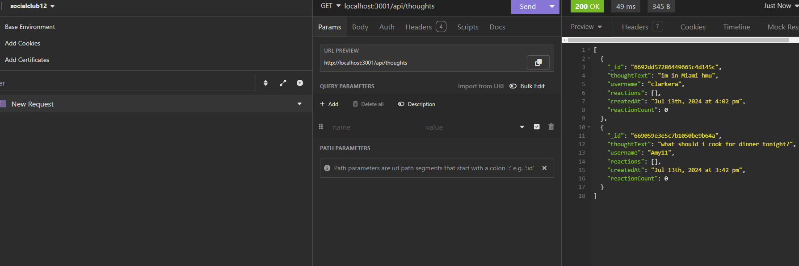

# socialclub12

## Desciption

I created an API for a social network web application where users can share their thoughts, react to friends’ thoughts, and create a friend list. I used Express.js for routing, a MongoDB database, and Mongoose. I also used JavaScript to format timestamps. This API will come in handy to anyone who wants to test routes for their social media site.

## Demonstration Link

https://youtu.be/41mNSLM8Bnk

## Screenshot

